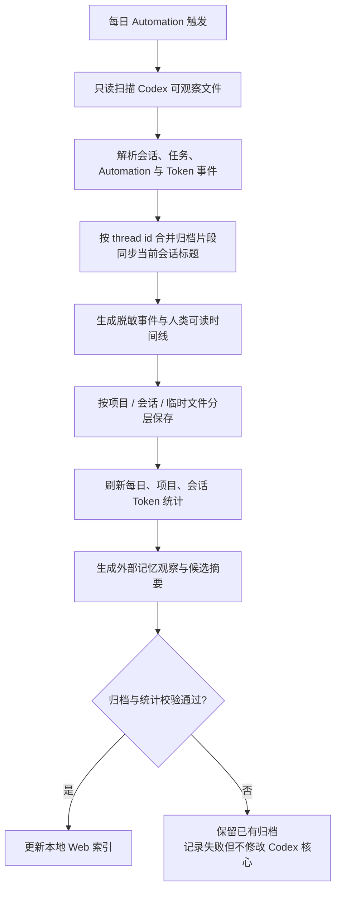
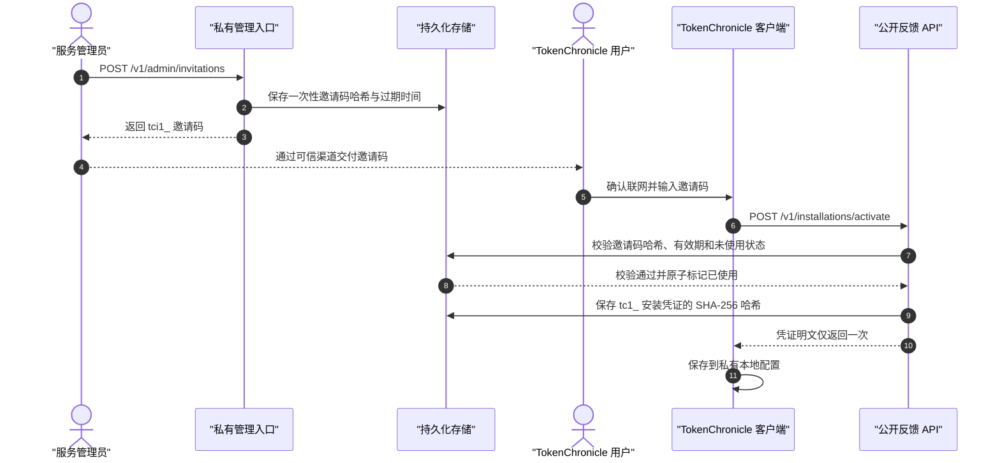
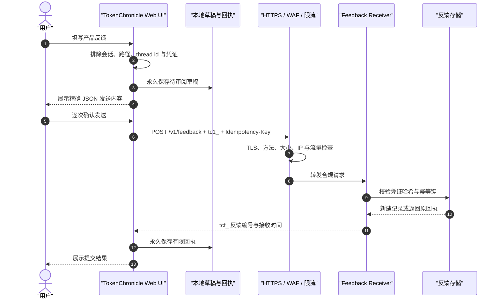
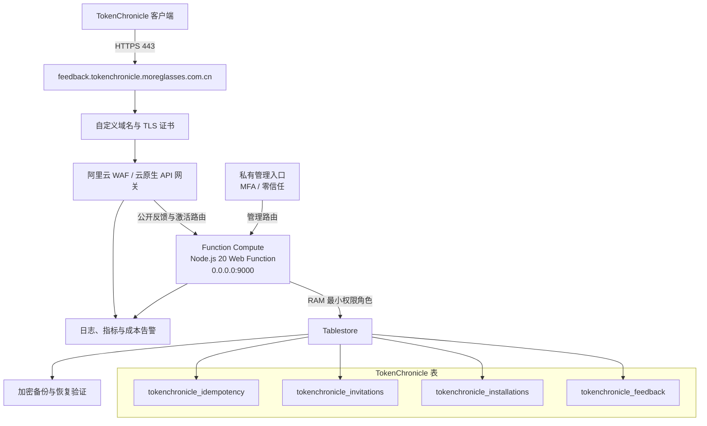
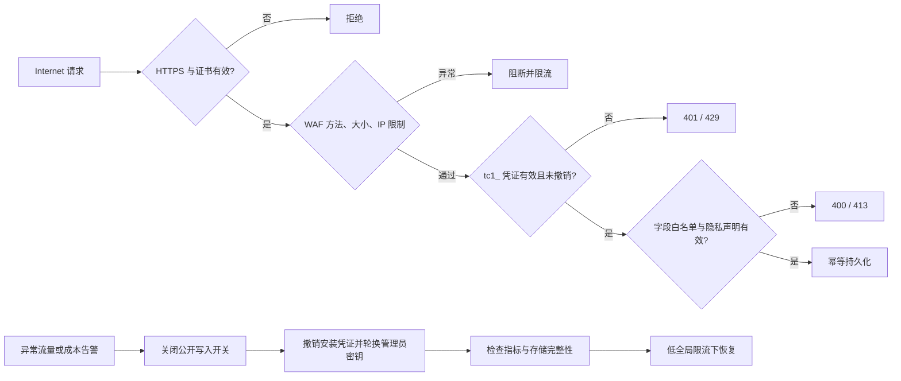
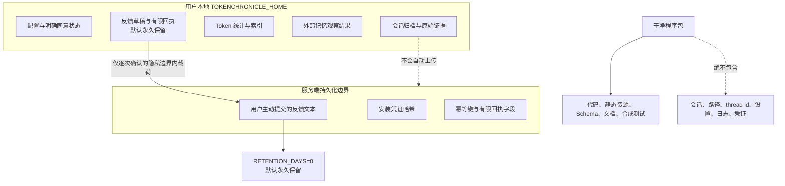

# TokenChronicle Architecture Diagrams

本文档使用 TokenChronicle 首发版本的正式名称、域名和协议，作为产品、部署与安全设计的统一图集。

## 1. 总体架构

```mermaid
flowchart LR
    subgraph Client["用户设备"]
        Codex["Codex 本地会话与过程记录"]
        Collector["TokenChronicle 只读采集器"]
        Archive["本地归档、索引与统计"]
        Viewer["TokenChronicle Web 浏览器"]
        Drafts["反馈草稿与回执\n永久本地保留"]
    end

    subgraph Cloud["TokenChronicle 反馈服务"]
        Domain["feedback.tokenchronicle.moreglasses.com.cn"]
        Edge["HTTPS、WAF、限流"]
        Receiver["Feedback Receiver API"]
        Store["持久化反馈存储"]
    end

    Codex -->|"只读观察"| Collector
    Collector --> Archive
    Archive --> Viewer
    Viewer --> Drafts
    Drafts -. "用户逐次确认后发送\n不包含会话内容" .-> Domain
    Domain --> Edge --> Receiver --> Store
```

## 2. 每日自动归档流程

## 3. 安装实例激活时序

## 4. 反馈提交时序

## 5. 阿里云部署架构

## 6. 安全防护与受攻击时的处置链路

## 7. 数据隔离与持久化边界

